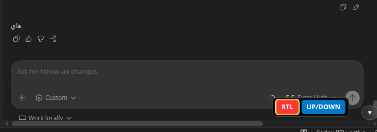
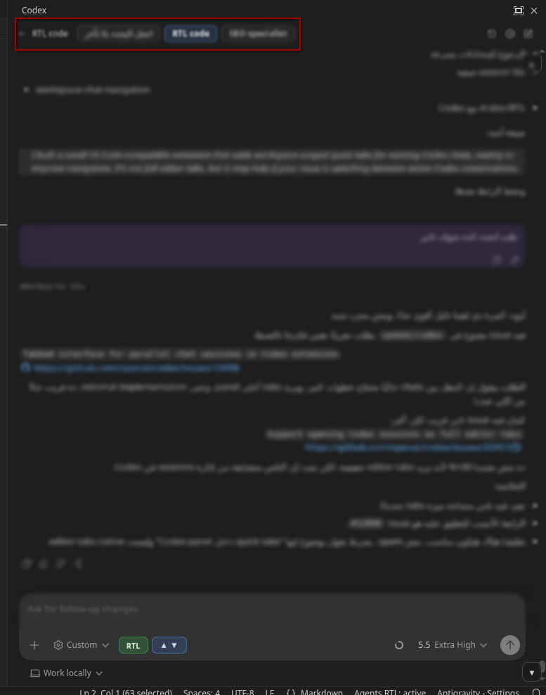

# Agents RTL

Link:https://marketplace.visualstudio.com/items?itemName=Nad3r.agents-rtl

Plug-and-play Arabic RTL support for AI agent webviews in VS Code.

Supports Linux and Windows.

## Before / After

Without RTL:

With RTL:

Install, restart VS Code once if prompted, then open VS Code normally with `code`.

No launcher. No recording. No cloud service.
